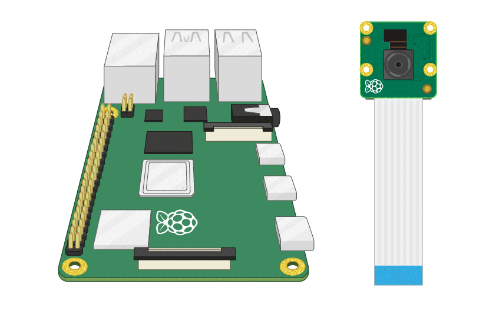

# Home Security - Face Detection

### Installation

First, navigate into the project directory:

```bash
cd face-detection
```

Setup a virtual environment
```bash
python -m venv venv --system-site-packages
. venv/bin/activate
```
Install requirements

```bash
pip install -r requirements.txt
```

## Download `key.json` from Firebase

1. Go to the [Firebase Console](https://console.firebase.google.com/).
2. Select your project.
3. Navigate to `Project settings` > `Firebase Admin SDK`.
4. Click on "Generate new private key" and save the file as `key.json` to your project directory.


## Creating Dataset

Switch to the remote desktop through `VNC Viewer` and open a new terminal  
Navigate into the project directory  
Activate venv

```bash
cd face-detection
. venv/bin/activate
```
Run `collect_imgs.py` to capture pictures of yourself
```bash
python collect_imgs.py
```

## Train the recogniser

```bash
python train.py
```

## Run the application

Finally, run the application:

```bash
python app.py
```

## Connecting Camera To Raspberry Pi 4 
  
  